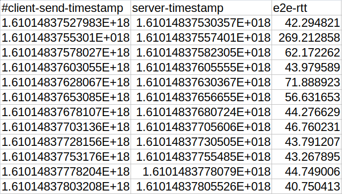
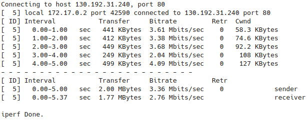
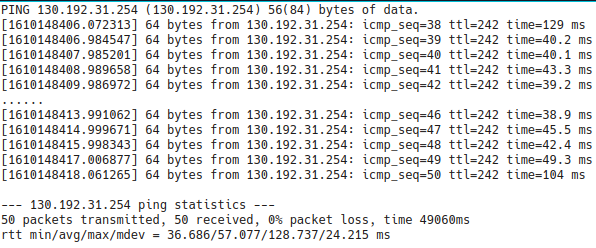

# Latency Tester

GoLang tool designed to test the latency between a client and a server.
The two endpoints interact using Websocket as communication protocol: it provides a full-duplex communication channel over a single TCP connection.
The tool can run with different parameters set as command line arguments.

Collected metrics (.csv file as output):
* E2E application delay with Websocket
* TCP main socket parameters

The client is wrapped around by an enhanced version of it, that is able to run the client in the most powerful way by
defining many parameters in a single YAML file and generates few helpful plots to analyse data.

The structure of the project repository is:

- Enhanced Client
  - Client
  - Plotter
- Server

## Server

The server is a simple thread that receives packets from the client, adds the timestamp and sends it back. It can be
deployed in all kind of environments provided that the client is able to reach it from inside or outside the LAN.

## Client

The client is a complex but easy to run executable, flexible with its parameters and efficient for the language used and
the protocol chosen. It is useful in cloud environments, where we are able to consistently calculate the latency towards
a pod instead of having to rely on the standard ping tool, which usually cannot even be used.

Initially it sets server response packet size with a control message. Then it starts sending the packets requested by
the user input flags and stores the RTT inside a csv file. If requested it stores TCP socket statistics and a traceroute
output too. **Beware of the TCP stats, because if the execution is long, the size of the output will be incredibly
huge!**

## How to run

### Server

```
docker pull richimarchi/latency-tester_server
docker run -p 8080:8080 [--name <container-name>] richimarchi/latency-tester_server [-addr=<ip:port>] [-tls=<enabled>]
```

Latest version: `1.0.0`

#### Server flags:

|Param|Description|Default Value|
|---|---|---|
|`-addr`|Listening address and port|`0.0.0.0:8080`|
|`-tls`|`true` if TLS requested|`false`|

### Client

```
docker pull richimarchi/latency-tester_client
docker run [--name <container-name>] -v <local-log-folder>:/execdir richimarchi/latency-tester_client [-reps=<repetitions>] [-requestPayload=<bytes>] [-responsePayload=<bytes>] [-interval=<ms>] [-tcpStats=<enabled>] [-tls=<enabled>] [-traceroute=<address>] [-log=<log-file>] <address>
```

Latest version: `1.0.0`

#### Required input parameters

|Param|Description|
|---|---|
|`<address>`|Address of the running server|

#### Client flags:

|Param|Description|Default Value|
|---|---|---|
|`-reps`|Number of test repetition, if `0` it runs until given interrupt (`CTRL + C`)|`0`|
|`-requestPayload`|Request payload size (in bytes), minimum value: `62`|`64`|
|`-responsePayload`|Response payload size (in bytes), minimum value: `62`|`64`|
|`-interval`|Requests send interval (in milliseconds)|`1000`|
|`-tcpStats`|`true` if TCP Stats requested (short execution time is suggested, as it consumes a lot of CPU and RAM)|`false`|
|`-tls`|`true` if TLS requested|`false`|
|`-traceroute`|If present, address traceroute should run towards||
|`-log`|Define the name of the file|`log`|

## How to deploy the server into a Kubernetes cluster

Starting from the `serverDeploymentSkeleton.yaml` file, generate the custom deployment file depending on your hostname and deploy it in your k8s cluster:

```
export HOSTNAME=<custom-hostname>
envsubst < serverDeploymentSkeleton.yaml > customServerDeployment.yaml
kubectl apply -f customServerDeployment.yaml
```

*N.B.: Ingress annotations are ingress controller dependent*


## Latency Tester Enhanced Client

The enhanced client wraps the client and uses the file given as input to define the loops, the destinations and the different
parameters required, in order to have a variety of results from a single client to one or more servers.
It runs ping, tcpdump and the client of the tool to keep track of the latency at network, transport and application
level, so that we have a complete overview of all the layers.

Ping and tcpdump run in parallel, while the main loop executes the client combining the endpoints, the message send
intervals and the message sizes repeating it the requested times with a custom frequency. Before every run, an iperf run
registers the bandwidth of the network.

As output we will have the raw files but there will be also a folder called `plots` containing some graphs generated
using that data, so that the user can easily and quickly analyse the results of the test.

### Enhanced Client Workflow


### Enhanced Client Run

```
docker pull richimarchi/latency-tester_enhanced
docker run [--name <container-name>] -v <local-log-folder>:/execdir richimarchi/latency-tester_enhanced <settings-yaml-file>
```

Latest version: `1.0.0`

*If you want to disable TCP CUBIC window shrinking for long send intervals, add `--sysctl net.ipv4.tcp_slow_start_after_idle=0` flag*

If you want to re-run the plotting on the results of an enhanced client, here's what you can do:

```
docker pull richimarchi/latency-tester_plotter
docker run --rm -v <local-log-folder>:/execdir richimarchi/latency-tester_plotter <settings-yaml-file>
```

Latest version: `1.0.0`

#### Required input parameters

|Param|Description|
|---|---|
|`<settings-yaml-file>`|Yaml file that defines all the parameters needed for the enhanced client to run (example of the file in the section below)|

### Enhanced Client Ansible Deployment

It is possible to deploy the enhanced client on more than one host with the provided ansible playbook.

On the remote hosts:

- Add your local SSH public key in the `~/.ssh/authorized_keys`
  
On the local host:

- Edit the `~/.ssh/config` file by defining each of your remote hosts with a mapping like this one:
  ```
  Host <custom-hostname>
  Hostname <remote-ip>
  User <remote-user>
  ```
- Edit the `ansible/hosts` file by adding the list of all `<custom-name>` selected for each host in the step before
- Create a settings file  in the `ansible` directory
- Edit the `vars` section in the `ansible/playbook.yml` file, by selecting the remote directory name, the name of the 
  settings file created the step before and the version of the enhanced client you want to use
  
Once everything is set, move to the `ansible` directory and run the playbook with the command:
```
ansible-playbook playbook.yml
```

### Input Parameters

Here is an example of the input file:

```
# Enhanced Client Settings

# How many times to iterate
runs: 24
# Time interval between the start of two different runs (in minutes)
runs_interval: 60
# How much time each client execution should last (in seconds)
runs_step_duration: 30
# Iperf Destinations
iperfs:
- name: "Crownlabs"
  ip: "130.192.31.240"
  port: "80"
# Ping Destinations
ping_destinations:
- name: "Crownlabs"
  ip: "130.192.31.254"
# Interval between ping executions (in seconds)
ping_interval: 30
# List of endpoints to test E2E latency, defined by its name/description and its address
endpoints:
- description: "LB-4"
  destination: "130.192.31.242:8080"
- description: "LB-7"
  destination: "latency-tester.crownlabs.polito.it"
# List of intervals between the send of two messages to test E2E latency
intervals:
- 10
- 25
- 50
- 100
- 250
- 500
# List of request message sizes to test E2E latency
msg_sizes:
- 1024
- 10240
- 102400
- 1024000
# Response message size
response_size: 1024
# True if TLS enabled
tls_enabled: "true"
# Execution directory (if in Docker, this must coincide with the mapped directory)
exec_dir: "/execdir/"

# Plotting Settings

# How many percentiles to remove from the extremities of the plots (default 0 if omitted)
percentiles_to_remove: 1
# The minimum value in the plot for the RTT (automatically obtained if omitted)
#rtt_min: 10
# The maximum value in the plot for the RTT (automatically obtained if omitted)
# rtt_max: 20
# The runs we selectively want to plot (default all runs if omitted)
#runs_to_plot:
#- 1
#- 3
```

### Enhanced Client Output Examples

- Client csv output files
  
  

- Iperf raw report
  
  

- Ping raw report

  

- Boxplot
  
  

- CDF plots (3 versions, with each param as subject)

  

- E2E latency plots

  

- E2E latency hourly boxplots

  

- TCP ACK RTT plots

  

- Ping plot

  
