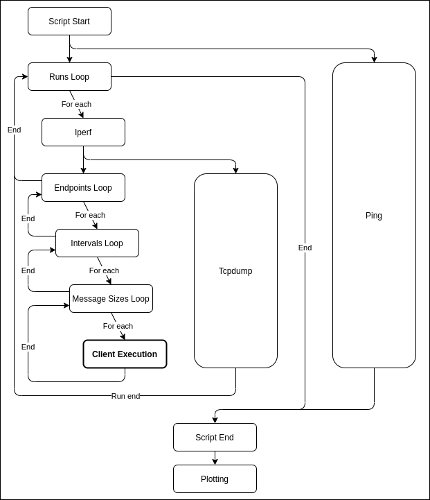

# Latency Tester

GoLang tool designed to test the latency between a client and a server.
The two endpoints interact using Websocket as communication protocol: it provides a full-duplex communication channel over a single TCP connection.
The tool can run with different parameters set as command line arguments.

Collected metrics (.csv file as output):
* E2E application delay with Websocket
* TCP main socket parameters

If requested, the result of traceroute can be retrieved too.

## How to run the docker

### Server

```
docker pull richimarchi/latency-tester_server
docker run -p 8080:8080 [--name <container-name>] richimarchi/latency-tester_server:latest [-addr=<ip:port>] [-tls=<enabled>]
```

#### Server flags:

|Param|Description|Default Value|
|---|---|---|
|`-addr`|Listening address and port|`0.0.0.0:8080`|
|`-tls`|`true` if TLS requested|`false`|

### Client

```
docker pull richimarchi/latency-tester_client
docker run [--name <container-name>] -v <local-log-folder>:/execdir richimarchi/latency-tester_client:latest [-reps=<repetitions>] [-requestPayload=<bytes>] [-responsePayload=<bytes>] [-interval=<ms>] [-tcpStats=<enabled>] [-tls=<enabled>] [-traceroute=<address>] [-log=<log-file>] <address>
```

#### Required input parameters

|Param|Description|
|---|---|
|`<address>`|Address of the running server|

#### Client flags:

|Param|Description|Default Value|
|---|---|---|
|`-reps`|Number of test repetition, if `0` it runs until given interrupt (`CTRL + C`)|`0`|
|`-requestPayload`|Request payload size (in bytes), minimum value: `62`|`64`|
|`-responsePayload`|Response payload size (in bytes), minimum value: `62`|`64`|
|`-interval`|Requests send interval (in milliseconds)|`1000`|
|`-tcpStats`|`true` if TCP Stats requested (short execution time is suggested, as it consumes a lot of CPU and RAM)|`false`|
|`-tls`|`true` if TLS requested|`false`|
|`-traceroute`|If present, address traceroute should run towards||
|`-log`|Define the name of the file|`log`|

## How to deploy the server into a Kubernetes cluster

Starting from the `serverDeploymentSkeleton.yaml` file, generate the custom deployment file depending on your hostname and deploy it in your k8s cluster:

```
export HOSTNAME=<custom-hostname>
envsubst < serverDeploymentSkeleton.yaml > customServerDeployment.yaml
kubectl apply -f customServerDeployment.yaml
```

*N.B.: Ingress annotations are ingress controller dependent*


## Latency Tester Automated Script

### Script Workflow



### Script Run

```
docker run [--name <container-name>] -v <local-log-folder>:/execdir richimarchi/lat-test_scripted-run:automated <settings-yaml-file>
```

*If you want to disable TCP CUBIC window shrinking for long send intervals, add `--sysctl net.ipv4.tcp_slow_start_after_idle=0` flag*

#### Required input parameters

|Param|Description|
|---|---|
|`<settings-yaml-file>`|Yaml file that defines all the parameters needed for the script to run (example of the file in the section below)|

### Input Parameters

Here is an example of the input file:

```
# How many times to iterate
runs: 24
# Time interval between the start of two different runs (in minutes)
runs_interval: 60
# How much time each client execution should last (in seconds)
runs_step_duration: 30
# Iperf IP
iperf_ip: "130.192.31.240"
# Iperf Port
iperf_port: "80"
# Ping IP
ping_ip: "130.192.31.254"
# Interval between ping executions (in seconds)
ping_interval: 30
# List of endpoints to test E2E latency, defined by its name/description and its address
endpoints:
- description: "LB-4"
  destination: "130.192.31.242:8080"
- description: "LB-7"
  destination: "latency-tester.crownlabs.polito.it"
# List of intervals between the send of two messages to test E2E latency
intervals:
- 10
- 25
- 50
- 100
- 250
- 500
# List of request message sizes to test E2E latency
msg_sizes:
- 1024
- 10240
- 102400
- 1024000
# Response message size
response_size: 1024
# True if TLS enabled
tls_enabled: "true"
```

### Script Output

- Client csv output files
- Iperf raw report
- Boxplots
- CDF plots
- E2E latency plots
- TCP ACK RTT plots
- Ping plot
