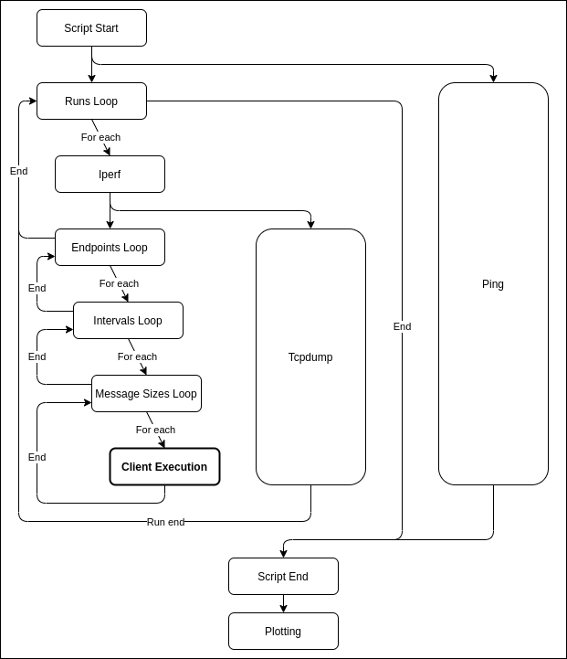

# Latency Tester Enhanced Client

The enhanced client wraps the client and uses the file given as input to define the loops, the destinations and the different
parameters required, in order to have a variety of results from a single client to one or more servers.
It runs ping, tcpdump and the client of the tool to keep track of the latency at network, transport and application
level, so that we have a complete overview of all the layers.

Ping and tcpdump run in parallel, while the main loop executes the client combining the endpoints, the message send
intervals and the message sizes repeating it the requested times with a custom frequency. Before every run, an iperf run
registers the bandwidth of the network (**In order to use this feature an iperf3 server has to be manually deployed to 
the designated machine**).

As output we will have the raw files but there will be also a folder called `plots` containing some graphs generated
using that data, so that the user can easily and quickly analyse the results of the test.

## Enhanced Client Workflow



## Enhanced Client Run

```
docker pull richimarchi/latency-tester_enhanced
docker run [--name <container-name>] -v <local-log-folder>:/execdir richimarchi/latency-tester_enhanced /execdir/<settings-yaml-file>
```

Latest version: `1.0.0`

### Required input parameters

|Param|Description|
|---|---|
|`<settings-yaml-file>`|Yaml file that defines all the parameters needed for the enhanced client to run|


*If you want to disable TCP CUBIC window shrinking for long send intervals, add `--sysctl net.ipv4.tcp_slow_start_after_idle=0` flag*

## Input Parameters

Here is an example of the input file:

Legend:

- `run` = The execution of all the combinations together
- `step` = The execution of a single combination

```
# Enhanced Client Settings

# How many times to iterate
runs: 24
# Time interval between the start of two different runs (in minutes)
runs_interval: 60
# How much time each client execution should last (in seconds)
runs_step_duration: 30
# Iperf Destinations
iperf_destinations:
- name: "Deployed-Iperf3-Server"
  ip: "34.56.78.90"
  port: "80"
# Ping Destinations
ping_destinations:
- name: "Pingable-Host"
  ip: "23.45.67.89"
# Interval between ping executions (in seconds)
ping_interval: 30
# List of endpoints to test E2E latency, defined by its name/description and its address
endpoints:
- description: "1_Example-Address"
  destination: "12.34.56.67:8080"
- description: "2_Example-Hostname"
  destination: "latency-tester.example.com"
# List of intervals between the send of two messages to test E2E latency
intervals:
- 10
- 25
- 50
- 100
- 250
- 500
# List of request message sizes to test E2E latency
msg_sizes:
- 1024
- 10240
- 102400
- 1024000
# Response message size
response_size: 1024
# True if TLS enabled
tls_enabled: "true"
# Execution directory (if in Docker, this must coincide with the mapped directory)
exec_dir: "/execdir/"
```

In this example, there are 2 (endpoints) x 6 (intervals) x 4 (sizes) = 48 combinations. Each combination is a step of a
run. Each steps lasts 30 seconds, therefore the duration of all the combination in a single run is 24 minutes. Between
the start of a run and the next one, there are 60 minutes, then the complete duration of all the 24 runs is 24 hours.


## Enhanced Client Ansible Deployment

It is possible to deploy the enhanced client on more than one host with the provided ansible playbook.

On the remote hosts:

- Add your local SSH public key in the `~/.ssh/authorized_keys`

On the local host:

- Edit the `~/.ssh/config` file by defining each of your remote hosts with a mapping like this one:
  ```
  Host <custom-hostname>
  Hostname <remote-ip>
  User <remote-user>
  ```
- Edit the `ansible/hosts` file by adding the list of all `<custom-name>` selected for each host in the step before
- Create a settings file  in the `ansible` directory
- Edit the `vars` section in the `ansible/playbook.yml` file, by selecting the remote directory name, the name of the
  settings file created the step before and the version of the enhanced client you want to use

Once everything is set, move to the `ansible` directory and run the playbook with the command:
```
ansible-playbook playbook.yml
```

## Enhanced Client Output Examples

- Client csv output files

  [Example File](../examples/1-130.192.31.242:8080.i250.x1024.csv)

  File reporting the application-level latency between the client and the server, keeping also trace of the timestamps
  of both hosts. The client timestamp is the sending one, whereas the receiving one is used to calculate the round trip
  time.

  ```
  #client-send-timestamp,server-timestamp,e2e-rtt
  1611336441708429104,1611336441732325106,43.745733
  1611336441958579188,1611336441982435400,41.819516
  1611336442208693801,1611336442234417528,44.20757
  1611336442459715445,1611336442483520866,41.904871
  1611336442709978344,1611336442733883971,40.867048
  ```

- Iperf raw report

  [Example File](../examples/1-iperf_Crownlabs.txt)

  File reporting the output of the `iperf3` command from the client to the designated iperf3 server. The field we want
  to have a look at is the `Bitrate` one, so that we know the average bandwidth at the moment of the measurement.

  ```
  Connecting to host 130.192.31.240, port 80
  [  5] local 172.17.0.2 port 39566 connected to 130.192.31.240 port 80
  [ ID] Interval           Transfer     Bitrate         Retr  Cwnd
  [  5]   0.00-1.00   sec   464 KBytes  3.80 Mbits/sec    0   55.6 KBytes       
  [  5]   1.00-2.00   sec   458 KBytes  3.75 Mbits/sec    0   73.2 KBytes       
  [  5]   2.00-3.00   sec   264 KBytes  2.16 Mbits/sec    0   90.8 KBytes       
  [  5]   3.00-4.00   sec   499 KBytes  4.09 Mbits/sec    0    110 KBytes       
  [  5]   4.00-5.00   sec   312 KBytes  2.55 Mbits/sec    0    127 KBytes
  - - - - - - - - - - - - - - - - - - - - - - - - -
  [ ID] Interval           Transfer     Bitrate         Retr
  [  5]   0.00-5.00   sec  1.95 MBytes  3.27 Mbits/sec    0             sender
  [  5]   0.00-5.35   sec  1.82 MBytes  2.85 Mbits/sec                  receiver
  
  iperf Done.
  ```

- Ping raw report

  [Example File](../examples/ping_Crownlabs.txt)

  File containing the output of the `ping` command. The first field of the ping record is the timestamp of the received
  frame, in order to keep track of the ping latency throughout the whole execution, whereas the delay is represented by
  the `time` field at the end of each line.

  ```
  PING 130.192.31.254 (130.192.31.254) 56(84) bytes of data.
  [1611336429.383812] 64 bytes from 130.192.31.254: icmp_seq=1 ttl=242 time=71.8 ms
  [1611336430.358613] 64 bytes from 130.192.31.254: icmp_seq=2 ttl=242 time=45.1 ms
  [1611336431.355965] 64 bytes from 130.192.31.254: icmp_seq=3 ttl=242 time=42.0 ms
  [1611336432.360581] 64 bytes from 130.192.31.254: icmp_seq=4 ttl=242 time=45.6 ms
  [1611336433.361396] 64 bytes from 130.192.31.254: icmp_seq=5 ttl=242 time=45.0 ms
  ...
  [1611336479.412320] 64 bytes from 130.192.31.254: icmp_seq=51 ttl=242 time=36.5 ms
  [1611336480.412441] 64 bytes from 130.192.31.254: icmp_seq=52 ttl=242 time=35.3 ms
  [1611336481.415124] 64 bytes from 130.192.31.254: icmp_seq=53 ttl=242 time=37.2 ms
  [1611336482.415148] 64 bytes from 130.192.31.254: icmp_seq=54 ttl=242 time=35.8 ms
  [1611336483.414928] 64 bytes from 130.192.31.254: icmp_seq=55 ttl=242 time=34.5 ms
  
  --- 130.192.31.254 ping statistics ---
  55 packets transmitted, 55 received, 0% packet loss, time 54068ms
  rtt min/avg/max/mdev = 34.413/52.714/261.110/48.222 ms
  ```

- Tcpdump csv output files

  [Example File](../examples/1-tcpdump_report.csv)

  File containing the timestamp of the frame acking the one which the rtt is counted from, the round trip time between
  these two packets and the stream id in order to be able to distinguish the parameters combination of a certain stream.

  ```
  #frame-timestamp,tcp-ack-rtt,tcp-stream-id
  "1611336442.750143006","0.039583780","0"
  "1611336443.002436800","0.041769282","0"
  "1611336443.251176239","0.040232318","0"
  "1611336443.503958671","0.043235419","1"
  "1611336443.751584653","0.040869367","1"
  ```
