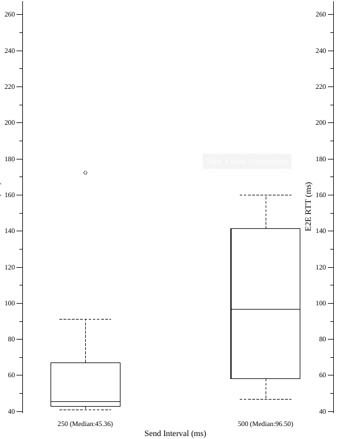
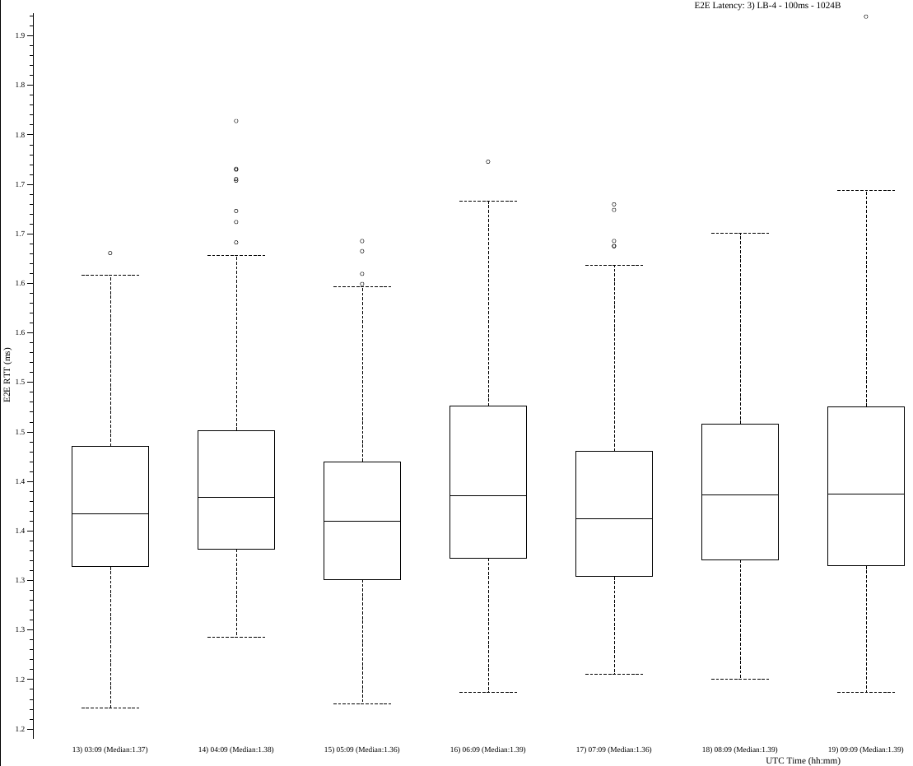
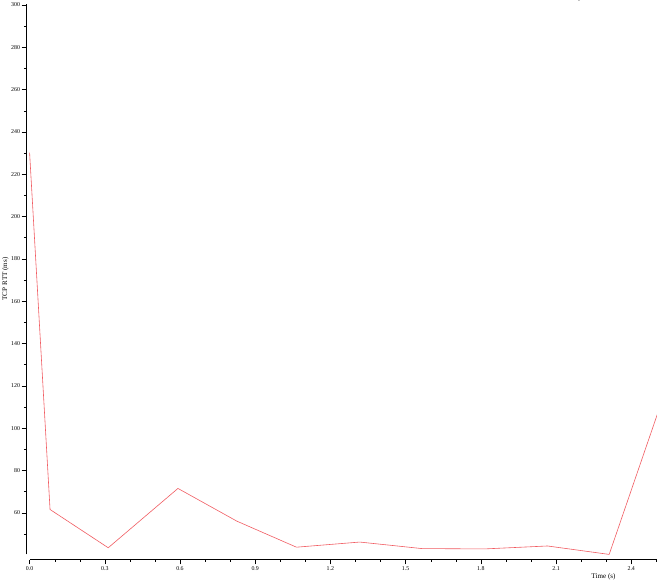
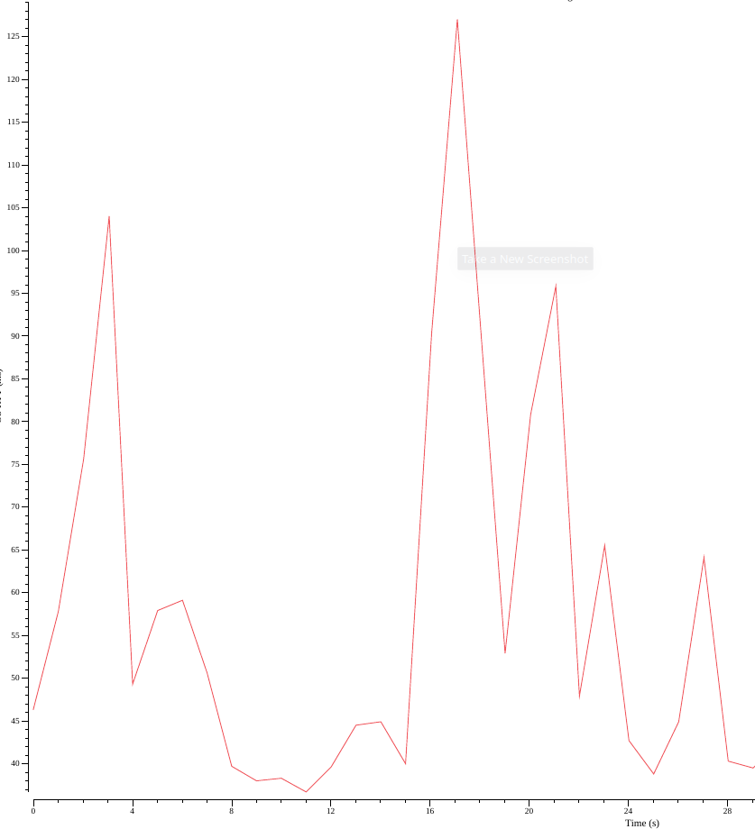

# Latency Tester Plotter

## How to deploy

```
docker pull richimarchi/latency-tester_plotter
docker run --rm -v <local-log-folder>:/execdir richimarchi/latency-tester_plotter /execdir/<settings-yaml-file>
```

Latest version: `1.0.0`

### Required input parameters

|Param|Description|
|---|---|
|`<settings-yaml-file>`|Yaml file that defines all the parameters needed for the enhanced client to run|

### Settings file example

The setting file is the same one requested by the enhanced client, but it is possible to add few plotting options
in order to manipulate the data and have more readable plots.

Here is an example of the options:

```
# Enhanced Client Settings

...
(The settings used to run the enhanced client)
...

# Plotting Settings

# How many percentiles to remove from the extremities of the plots (default 0 if omitted)
percentiles_to_remove: 1
# The minimum value in the plot for the RTT (automatically obtained if omitted)
rtt_min: 10
# The maximum value in the plot for the RTT (automatically obtained if omitted)
rtt_max: 20
# The runs we selectively want to plot (default all runs if omitted)
runs_to_plot:
- 1
- 3
```

## Plotter Output Examples

- BoxPlot

  [Endpoints Example](../../examples/endpointsBoxPlot.pdf)
  
  [Intervals Example](../../examples/intervalsBoxPlot.pdf)
  
  [Message Sizes Example](../../examples/sizesBoxPlot.pdf)

  Taking into account all the type of parameters of the measurement, these three plots give us a summary of the data
  gathered about the round trip time in the different scenarios we requested.

  

- CDF plots

  [Endpoints Example](../../examples/endpointsCDF.pdf)

  [Intervals Example](../../examples/intervalsCDF.pdf)

  [Message Sizes Example](../../examples/sizesCDF.pdf)

  Taking into account all the type of parameters of the measurement, these three plots give us the distribution of the
  data gathered about the round trip time in the different scenarios we requested.

  

- E2E latency plots

  [Example File](../../examples/e2eLatency.pdf)

  The plotter puts together all the runs regarding each combination of the parameters and plots the round trip time
  variation throughout the execution of the enhanced client.

  

- Per run E2E latency BoxPlots

  [Example File](../../examples/e2eLatencyHourlyBoxplot.pdf)

  A BoxPlot representation of the round trip time during each run of every combination of the parameters.

  

- TCP ACK RTT plots

  [Example File](../../examples/1-tcpPlot.pdf)
  
  This plot describes the TCP ACK round trip time variation throughout the execution of each run of  the enhanced client.

  

- Ping plot

  [Example File](../../examples/pingPlot.pdf)

  Representation of the variation of the network-level round trip time throughout the execution of the enhanced client.

  
